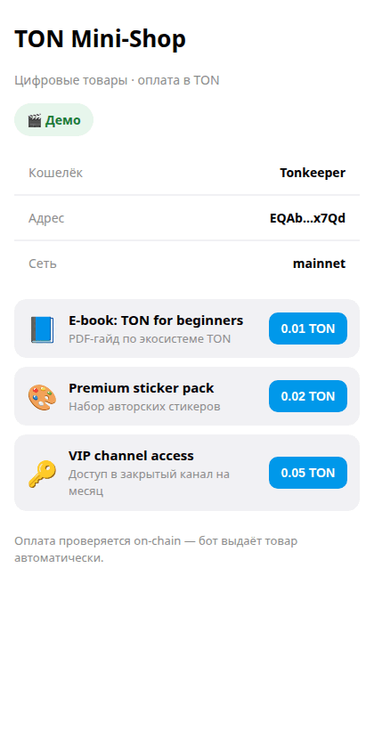
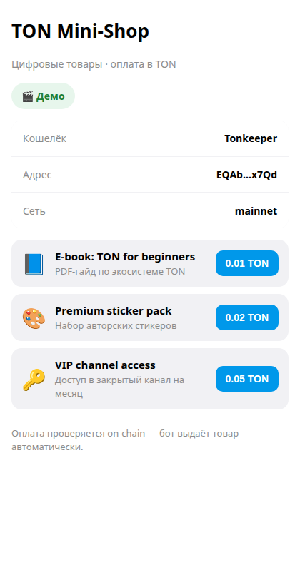
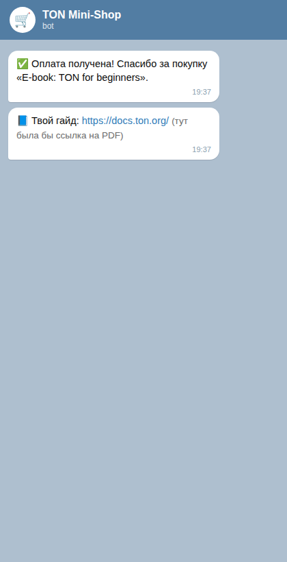
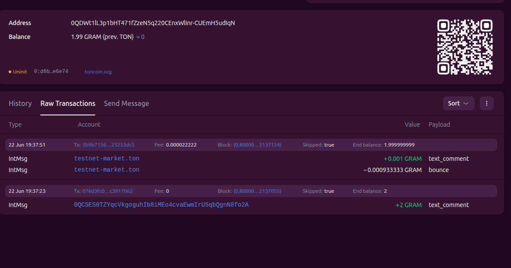

# TON Mini-Shop 🛒

A **Telegram Mini App store on The Open Network (TON)**: a customer connects their wallet, buys a digital product, pays in TON — and a bot **verifies the payment on-chain** and **auto-delivers** the product in chat.

Built as a real, end-to-end demonstration of accepting crypto payments inside Telegram.

> ⚙️ Stack: React + TypeScript + Vite · TON Connect · @ton/core · grammY (Node) · tonapi.io

---

## 🎬 Demo

<p align="center">
  
</p>

Browse the catalog → pay in TON → the order is verified **on-chain** and the bot delivers the product in chat.

| Storefront | Delivered in chat |
|---|---|
|  |  |

**On-chain proof** — each payment carries an order tag in its `text_comment`, so the bot knows *who* paid for *what*, trusting the blockchain rather than the frontend:

<p align="center">
  
</p>

> 💡 Live demo of the storefront (no wallet needed): add `?demo=1` to the app URL.

---

## ✨ What it does

- **Opens inside Telegram** as a Mini App (no install, 950M+ potential users)
- **Connects a TON wallet** via TON Connect (Tonkeeper & others)
- **Accepts payments** — each product has its own price; the user confirms in their wallet
- **Tags each order on-chain** with a comment (`product + buyer`) so payments are identifiable
- **Verifies payment on-chain** — the backend trusts the blockchain, not the frontend
- **Auto-delivers** the product to the buyer in their Telegram chat

## 🧩 How it works

Fully **serverless** — no always-on process. Payment is verified *on demand* right after the user pays:

```
Customer (Telegram Mini App)
        │  1. Connect wallet (TON Connect)
        │  2. Tap "Buy" → sign payment in wallet
        ▼
   TON blockchain  ──  payment carries an order tag:  o:<productId>:<telegramUserId>
        ▲
        │  3. App calls  POST /api/verify   (Vercel Serverless Function)
        │  4. Function reads the payment via tonapi.io, checks tag + amount
        │  5. Delivers the product to the buyer via Telegram Bot API
   Serverless backend (Vercel Functions)
```

Why on-demand instead of polling: serverless has no persistent process, and it means delivery works for **any** customer who opens the link — nothing has to be kept running.

Safeguards:
- **Trusts the chain, not the client** — delivery only happens if a matching payment (exact order tag + sufficient amount) is found on-chain.
- **No stale deliveries** — only payments within a recent time window are honored. *(For high order volume, add per-tx-hash dedup in Vercel KV / Upstash.)*

## 🗂 Project structure

```
ton-mini-shop/
├── app/                     # Telegram Mini App (React + Vite + TS) + serverless API
│   ├── src/
│   │   ├── App.tsx          # UI, wallet connect, payment, polls /api/verify
│   │   └── products.ts      # catalog (UI)
│   ├── api/
│   │   ├── verify.js        # verify payment on-chain → deliver product
│   │   └── telegram.js      # Telegram webhook (/start)
│   └── lib/catalog.js       # server-side catalog (price + delivered content)
└── bot/                     # legacy standalone poller (local dev / non-serverless host)
```

## 🚀 Run & deploy

**Frontend (local)**
```bash
cd app
npm install
npm run dev        # local dev (note: /api/* functions run only on Vercel)
npm run build
```

**Deploy to Vercel** (frontend + `/api` functions in one project)
```bash
cd app
vercel --prod
# set secrets once (used by the functions, never sent to the browser):
vercel env add BOT_TOKEN production
vercel env add MERCHANT_ADDRESS production
```

**Point Telegram at the webhook** (so `/start` works), once:
```bash
curl "https://api.telegram.org/bot<BOT_TOKEN>/setWebhook" \
  --data-urlencode "url=https://<your-app>.vercel.app/api/telegram"
```
Also set the app URL as the bot's Menu Button in @BotFather.

## 🔐 Notes

- Secrets (`BOT_TOKEN`, `MERCHANT_ADDRESS`) live only in Vercel env / `bot/.env` (git-ignored) — never in the frontend bundle.
- TON Connect never exposes the user's private keys; payments are signed inside the wallet.
- Tested live on mainnet with micro-amounts.
- `bot/` is the original always-on poller. It uses long-polling, so it **cannot run while the Telegram webhook is set** — delete the webhook first (`deleteWebhook`) if you want to use it instead.

## 👤 Author

Built by **[@YarikDaddy](https://github.com/YarikDaddy)** — building in public on [X / @DaddyYarik](https://x.com/DaddyYarik).

Open to small paid tasks: Telegram Mini Apps & TON integrations, paid in TON/USDT.
